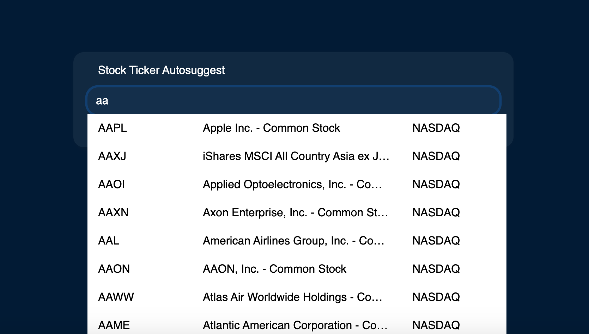

# Introduction

### What

This project is intended to provide stock symbol autosuggest feature for my other projects. There are pratical reasons why I decided to build a seperate service just to search stock symbol. Please read below.

### Why

Implementing a autosuggest search feature requires a search call for each character typed. One critical problem for implementing this feature using readily available api is that most of them have some form of **rate limiting**.

Imagine if an API has a 5 calls/min limit, that means we would have already maxed out our limit for that minute with just 5 characters typed from 1 user!

Turns out, almost all stock api that I could find have some form of **rate limiting** that makes it **impossible** to implement a autosuggest feature.

| API  | Rate Limit | Note |
| ------------- | ------------- | ------------- |
| AlphaVantage  | 5 calls/min | Weird API response, paid is 30 calls/min only
| Questrade  | 20 calls/sec | BUT need to manually (non-api) refresh token every 7 days
| Yahoo Finance | Infinite | Breaks term of service
| IEX  | - | Paid only for symbol search
| TD thinkorswim | - | No symbol search
| Google Finance | - | No symbol search
| Finnhub | - | No symbol search
| World trading data | - | No symbol search
| Many others... | - | Either **low rate limit**, or is paid only with other limitations that makes it not worthwhile (e.g. no realtime data)

A Static frontend search is also **not feasible**, because stocks are listed and delisted **every day**

In the end, the best way to implement stock symbol autosuggest is to create our own.

### How

Every day, the list of stocks are fetch directly from nasdaq into our database. This list is then searchable through API calls.

# Technology

### Frontend

- React
- JavaScript

### Backend 

- NodeJs 
- Express
- PostgresSQL
- Python (hosted on AWS Lambda)
